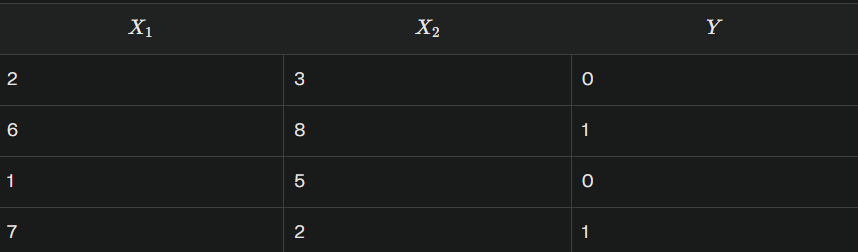
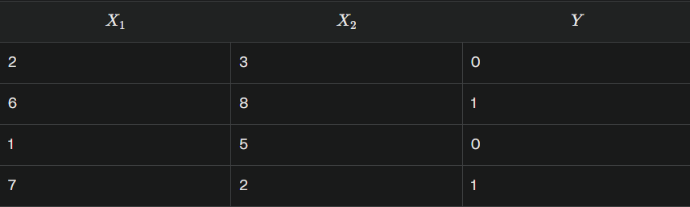
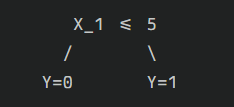
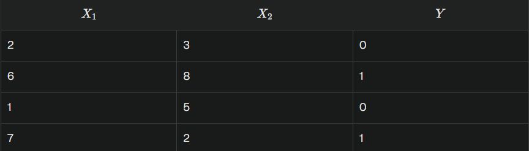
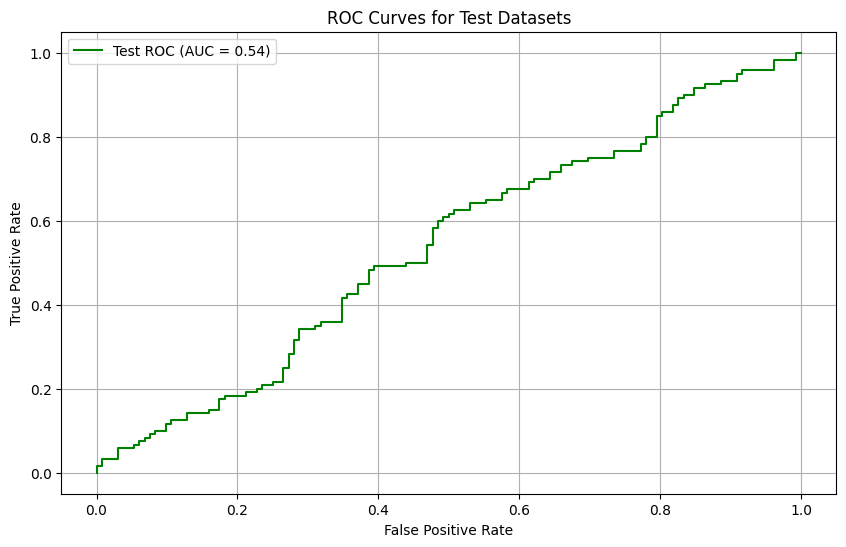
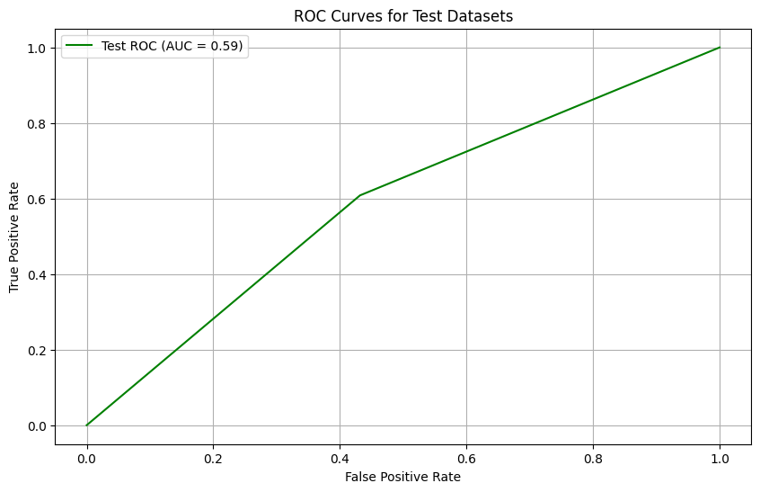
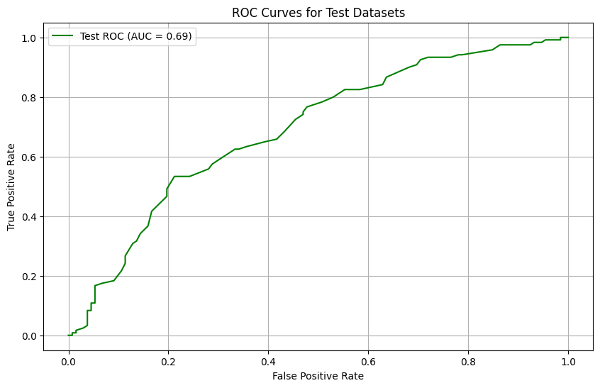

### Project Overview
This script contains real world stock price dataset(Amazon) collected from yahoo finance. I have applied three machine learning algorithms on this dataset: Logistic Regression, Decision Tree and Random Forest

### Method Overview
`Logistic Regression`: Suppose our dataset has two features $X_1$ and $X_2$ with target variable $Y$.

- Parameters(for simplicity, I am taking random values): 
    - Weights: $w_1$=0.5,$w_2$=0.3
    - Bias: $b$=-2.5
- Linear Combination:For each data point, compute the linear combination of the input features using the formula:
$$z=w_1⋅X_1+w_2⋅X_2+b$$
1. Data point 1:($X_1$=2,$X_2$=3)
$$z=0.5*2+0.3*3-2.5=-0.6$$
2. Data point 2:($X_1$=6,$X_2$=8)
$$z=0.5*6+0.3*8-2.5=-2.9$$
3. Data point 3:($X_1$=1,$X_2$=5)
$$z=0.5*1+0.3*5-2.5=-0.5$$
4. Data point 4:($X_1$=7,$X_2$=2)
$$z=0.5*7+0.3*2-2.5=1.6$$
- Apply Sigmoid Function: $$\sigma(z)=1/(1+e^{-z})$$
1. Data Point 1: $z=-0.6$
$$\sigma(-0.6)=1/(1+e^{0.6}) = 0.3543$$ 
2. Data Point 2: $z=2.9$
$$\sigma(2.9)=1/(1+e^{-2.9}) = 0.9478$$ 
3. Data Point 3: $z=-0.5$
$$\sigma(-0.5)=1/(1+e^{0.5}) = 0.3775$$ 
4. Data Point 4: $z=1.6$
$$\sigma(1.6)=1/(1+e^{-1.6}) = 0.8320$$ 
- Predictions: If the probability is greater than 0.5, predict $Y$=1; otherwise, predict $Y$=0
    

`Decision Tree`: Constructs a model in the form of a tree structure to make decisions based on the input features. I will explain with the same previous example how it works:

- Root node selection: Firstly, we need to decide on the best feature to split the data at the root node.
For simplicity, let's assume we choose $X_1$ as our first splitting feature.
- Splitting data: Let's choose a threshold value $X_1$=5 based on which we will split
    - left node: $X_1$ <=5, data points: (2,3,0),(1,5,0)
    - right node: $X_1$>5, data points: (6,8,1),(7,2,1)
- Leaf nodes: Since the data points in each node are perfectly classified, we can create leaf nodes directly.

- Prediction: If a new node comes with value (5,5), the model will predict $Y$ = 0

`Random Forest`:It is based on Decision tree but uses multiple trees(previous one uses single tree). I will consider the same dataset for this one as well

- Bootstrap Samples: It creates multiple subsets of the original dataset by sampling with replacement
    - Sample 1: (2,3,0),(6,8,1),(2,3,0),(7,2,1)
    - Sample 2: (6, 8, 1), (1, 5, 0), (7, 2, 1), (6, 8, 1)
    - Sample 3: (1, 5, 0), (2, 3, 0), (7, 2, 1), (1, 5, 0)
- Decision Tree Construction: For each bootstrap sample, we build a decision tree.
    - `Tree 1 (from Sample 1)` 
        - Root Node: Split on $X_1$≤5
        - Left Node: (2, 3, 0), (2, 3, 0) → $Y$=0
        - Right Node: (6, 8, 1), (7, 2, 1) → $Y$=1
    - Tree 2 (from Sample 2):
        - Root Node: Split on $X_1$≤5
        - Left Node: (1, 5, 0) → $Y$=0
        - Right Node: (6, 8, 1), (7, 2, 1), (6, 8, 1) → $Y$=1
    - Tree 3 (from Sample 3):
        - Root Node: Split on $X_1$≤5
        - Left Node: (1, 5, 0), (2, 3, 0), (1, 5, 0) → $Y$=0
        - Right Node: (7, 2, 1) → $Y$=1
- Prediction: For a new data point, (5,5)
    - Tree 1: $X_1$ =5≤5 → Left Node → Predicts $Y$=0
    - Tree 2: $X_1$ = 5≤5 → Left Node → Predicts $Y$=0
    - Tree 3: $X_1$ = 5≤5 → Left Node → Predicts $Y$=0

Since all trees predict $Y$=0, the final prediction for the data point (5,5) is $Y$ =0

### Results
`Logistic Regression`

`Decision Tree Classifier`

`Random Forest Classifier`

Random Forest performed better as it can capture more complex situations than other two algorithms

